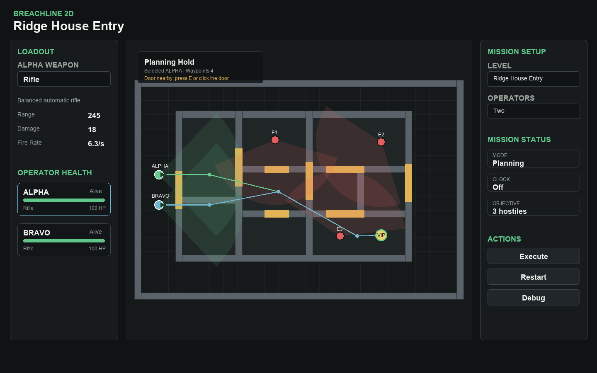

# Breachline 2D Gameplay Guide



## Gameplay

Breachline 2D is a top-down tactical breach game. You choose one or two operators, assign each operator a weapon, plan routes through the level, open doors manually with `E` or by clicking nearby doors, and let operators automatically engage enemies when they have clear line-of-sight. You can pause and replan at any time with `Space`.

The mission succeeds when the VIP/objective is secured or all hostiles are neutralized. The mission fails if all operators are down or the objective is compromised.

## How To Run

From this project folder, run:

```powershell
npm start
```

Then open:

```text
http://127.0.0.1:4700/
```

You can also run the server directly:

```powershell
node server.js
```

## Why A Dev Server Is Needed

The game loads level files from `level/` and equipment files from `equipment/` using browser `fetch()` requests. Many browsers block or restrict those requests when opening `index.html` directly through `file://`, so a local HTTP server makes the game behave like a normal web app.

The included server is only a static localhost server. It does not run gameplay logic on the backend.

## Do You Need To Install Node?

Yes, you need Node.js if you want to use `npm start` or `node server.js`. No extra npm packages are required because the server uses only built-in Node modules.

If Node.js is already installed, you can run the game immediately. If not, install the current Node.js LTS version, then run `npm start` again.
